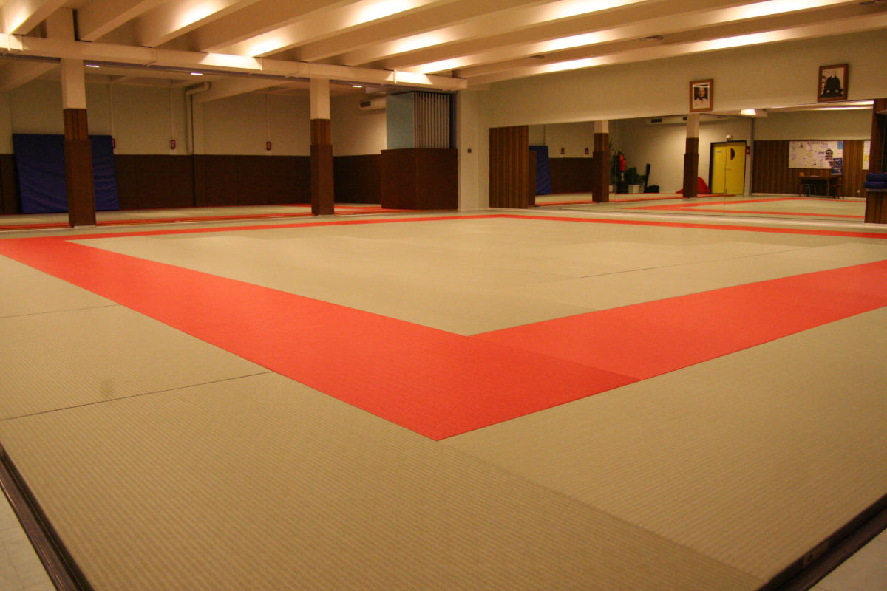
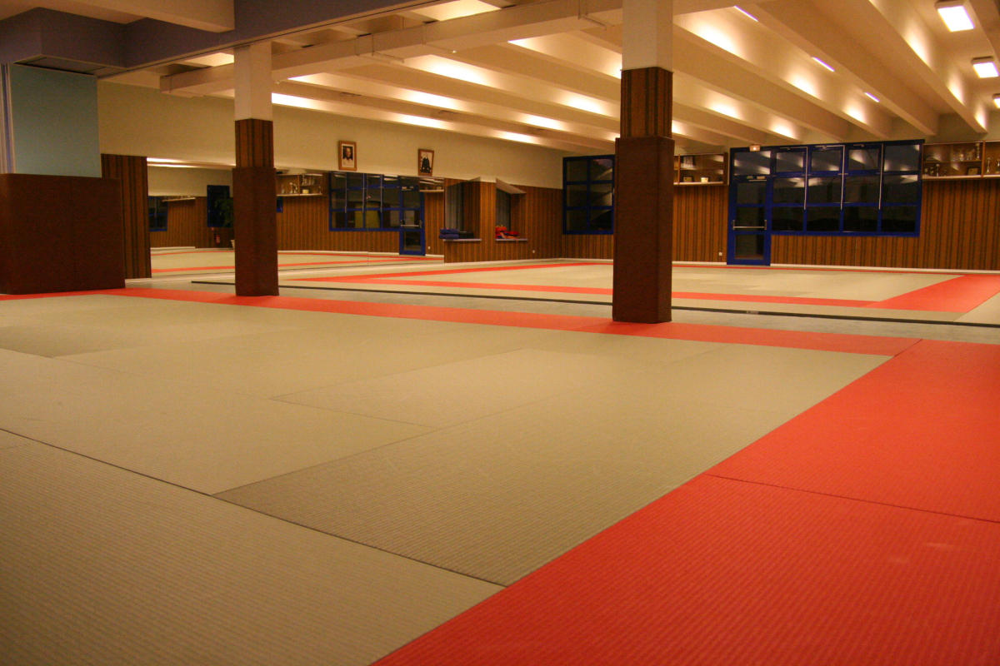
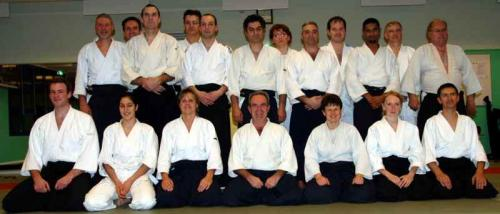

# Le Club

## Inscription

* Formulaire d'inscription pour la saison 2018-2019
    * [<i class="fa fa-file-word-o"></i> - fichier Word](files/Fiche d'inscription 2017-2018_0.doc)
    * [<i class="fa fa-file-pdf-o" ></i> - fichier PDF ](files/Fiche d'inscription 2017-2018_0.pdf)

* N'oubliez pas votre certificat médical <i class="fa fa-heartbeat" ></i> à faire étabir chez votre médecin

* [<i class="fa fa-file-pdf-o" ></i> - Guide Du Débutant](files/Aikido.pdf)

## Horaires des cours

| 	                 | Mardi         | Jeudi         | Samedi      |
|--------------------|---------------|---------------|-------------|
| Enfants            | 19h00 - 20h00 | 19h00 - 20h00 |             |
| Adultes            | 20h00 - 22h00 | 20h00 - 22h00 |             |
| Préparation grades |               |               | 10h00-12h00 |

<small>Les cours enfants n'ont pas lieu durant les périodes de vacances scolaires. Cependant, les cours adultes sont maintenus, hors période de Noël et de grandes vacances, de 20h à 22h.</small>

## Adresse

    Aikido Club Fegersheim
    Centre Socio-Educatif Culturel
    17a,rue du Général De Gaulle
    67640 FEGERSHEIM

[<i class="fa fa-map-signs" ></i> Plan d'accès Google Maps](https://goo.gl/maps/7hDNUDSjhAt)

## Dojo

La salle de dojo est au 1er étage du Centre Sportif, en 2002 le dojo était agrandi, et actuellement la surface totale comprends 2 espaces tatamis:

12 x 12 tatamis, salle principale avec les miroirs

11 x 7 tatamis

A coté de dojo il y a 3 vestiaires séparés (homme/femme) avec douches. 

## Dans les médias

* 2015

    * [<i class="fa fa-file-pdf-o" ></i> - Moisson de grade en juillet 2015 à Fegersheim](files/AikidoFegersheim2.pdf)

* 2006

    * [<i class="fa fa-file-pdf-o" ></i> - L'article sur le club](files/AikidoFegersheim.pdf) apparu dans le journal "Fegersheim - Ohnheim, Informations Municipales" (édition 2006).

## Histoire

L'aventure commence en 1987. Passionné par Aikido, cet art martial nouveau et mystérieux à l'époque en France, Erwin Schaller, épaulé par quelques amis qui partagent le même intérêt, organise les entraînements dans une des salles de Centre Sportif et Culturel de Fegersheim. Tout n'est pas simple au début et la salle est inadaptée, mais l'idée semble avoir du succès. Un cercle des pratiquants se forme et quelques mois plus tard les cours réguliers s'installent. Ainsi est né le club Aikido Fegersheim.

Christian Hauptmann (un des pionniers du club, aujourd'hui dans les rangs professeurs, 4e dan):

> Quand nous avons commencé, la première année, la salle était en parquet, alors avant chaque entraînement il fallait venir chercher les tatamis, les poser, puis à la fin, les déposer et les ramener dans le local, Raymond (gérant de bar au Centre Sportif) était content après nos cours.. <i class="fa fa-smile-o" ></i>

4 ans après, en 1991, la "section enfants" a été créée.

