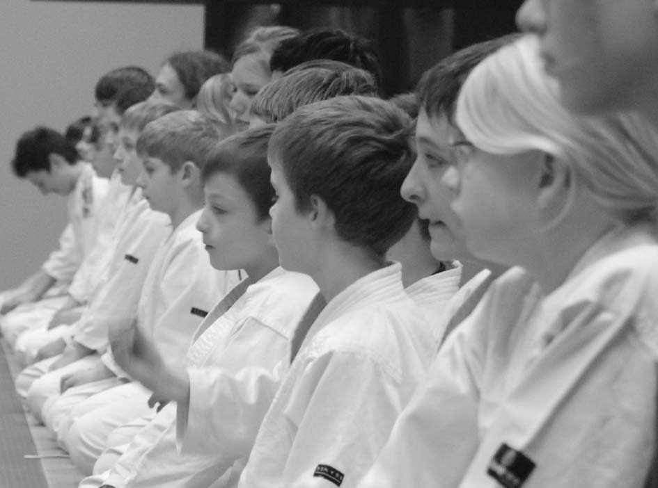
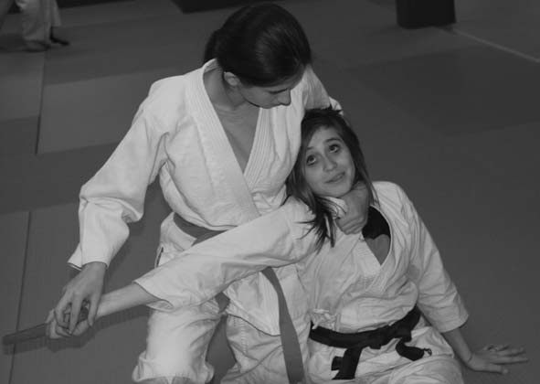

# Cours enfants

Depuis 1991 le club a une "section enfants". L'age des pratiquants de cette section est entre 7 et 15 ans. Une vingtaine d'enfants est présente dans les cours régulièrement. Les cours ont lieu tous les les Mardi et Jeudi, de 19h00 à 20h00, et les Jeudi une partie de cours est dédiée aux armes (Jo, le bâton). Les cours de la section "enfants" sont animés par :

* Sabine Perraut (4e dan), assisté de nos autres professeurs enfants :

    * Fabien Huber (2e dan)

